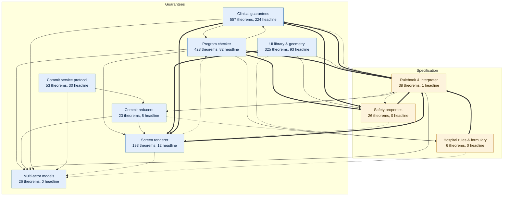
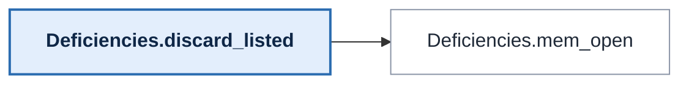
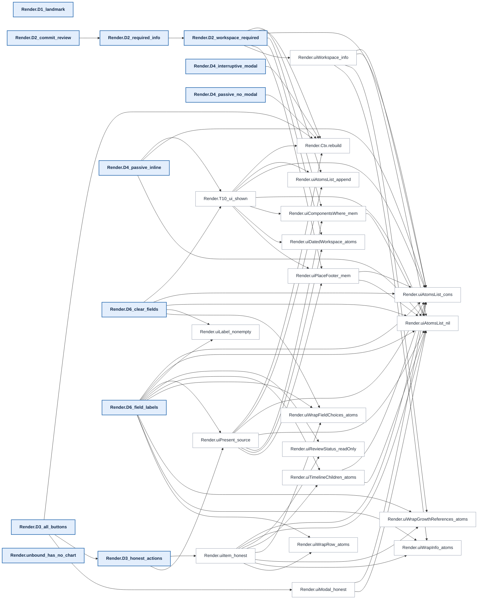
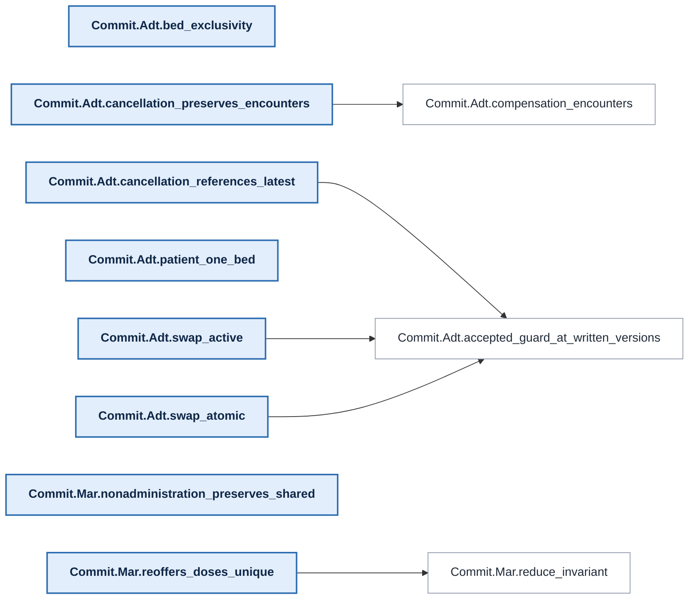
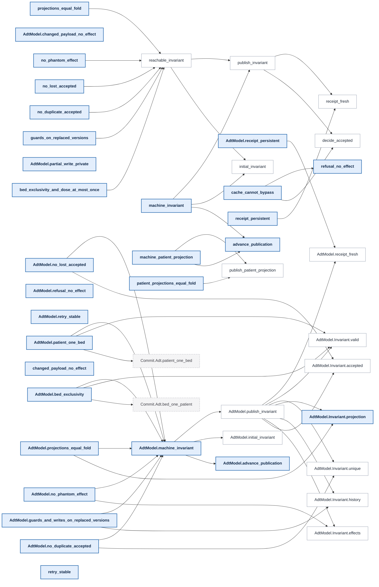
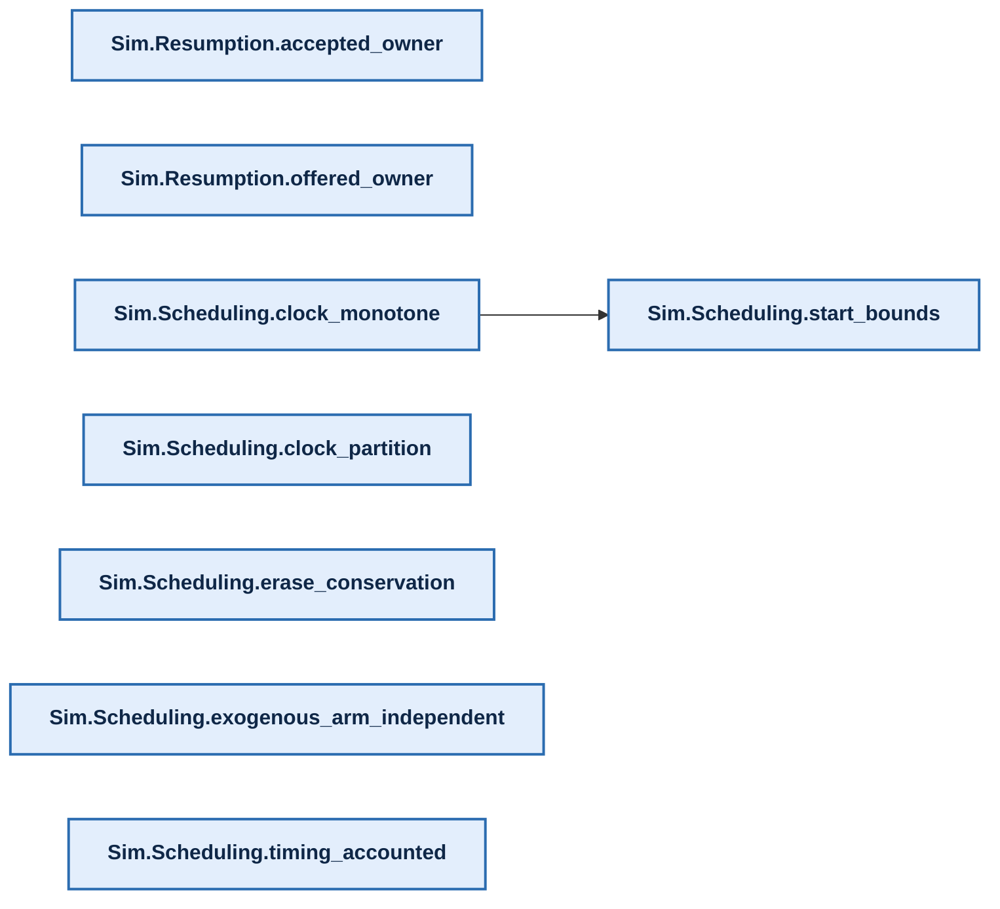
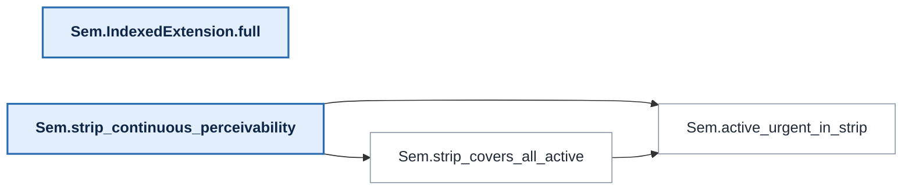

# Proof map

[Overview](../README.md) · [Methods and reproduction](../README.md#documentation)

<!-- PROOF-MAP:BEGIN (generated by scripts/proof-map/build.sh --readme; do not edit) -->

Generated from the compiled Lean environment. In the overview an arrow reads
"is stated in terms of" (thick: 100+ references, dotted: under 5). In each
layer's chart below an arrow reads "its proof cites": headline claims are
bold, lemmas they cite directly are white, lemmas from other layers are
dashed. The interactive version, with search, full
trees and each claim's trust surface, is the `proof-map` artifact of every CI
run.


```mermaid
flowchart TB
  subgraph guar_g["Guarantees"]
    proofs["Clinical guarantees<br/>557 theorems, 224 headline"]:::guar
    check["Program checker<br/>423 theorems, 82 headline"]:::guar
    render["Screen renderer<br/>193 theorems, 12 headline"]:::guar
    layout["UI library &amp; geometry<br/>325 theorems, 93 headline"]:::guar
    commit["Commit reducers<br/>23 theorems, 8 headline"]:::guar
    protocol["Commit service protocol<br/>53 theorems, 30 headline"]:::guar
    multi["Multi-actor models<br/>26 theorems, 0 headline"]:::guar
  end
  subgraph spec_g["Specification"]
    core["Rulebook &amp; interpreter<br/>38 theorems, 1 headline"]:::spec
    props["Safety properties<br/>26 theorems, 0 headline"]:::spec
    specs["Hospital rules &amp; formulary<br/>6 theorems, 0 headline"]:::spec
  end
  check ==> core
  check --> multi
  check --> proofs
  check ==> props
  check --> render
  check --> specs
  commit --> core
  commit --> multi
  commit --> render
  commit -.-> specs
  core -.-> commit
  core --> multi
  core -.-> proofs
  core -.-> props
  layout --> core
  layout --> props
  layout ==> render
  layout -.-> specs
  proofs --> check
  proofs ==> core
  proofs --> multi
  proofs ==> props
  proofs ==> render
  props ==> core
  props -.-> render
  protocol --> commit
  protocol --> multi
  render -.-> check
  render ==> core
  render -.-> multi
  specs ==> core
  specs -.-> multi
  classDef spec fill:#fdf3dc,stroke:#b7791f,color:#3d2a06
  classDef guar fill:#e3eefc,stroke:#2b6cb0,color:#0f2747
```

<details><summary><b>Rulebook &amp; interpreter</b>: 1 headline claim. The rulebook language, guards, alerts, navigation and the step interpreter. Every safety claim is stated in these terms.</summary>


```mermaid
flowchart LR
  n0["Deficiencies.discard_listed"]:::head
  n1["Deficiencies.mem_open"]:::lemma
  n0 --> n1
  classDef head fill:#e3eefc,stroke:#2b6cb0,stroke-width:2px,color:#0f2747,font-weight:bold
  classDef lemma fill:#ffffff,stroke:#8a94a6,color:#1f2937
  classDef other fill:#f4f4f5,stroke:#a1a1aa,stroke-dasharray:4 3,color:#3f3f46
```

</details>

<details><summary><b>Clinical guarantees</b>: 224 headline claims. Hard stop on signing, receipts, macros never act for a human, alert behaviour (T0–T6, A2, A4).</summary>

```mermaid
flowchart LR
  n0["Proofs.A2_popup_holds"]:::head
  n1["Proofs.A2_view_firing"]:::head
  n2["Proofs.A2_view_shown"]:::head
  n3["Proofs.A4_passive_never_popup"]:::head
  n4["Proofs.A4_run"]:::head
  n5["Proofs.A4_step"]:::head
  n6["Proofs.HypothesisExamples.all_buttons_instance"]:::head
  n7["Proofs.HypothesisExamples.cosign_distinct_instance"]:::head
  n8["Proofs.HypothesisExamples.popup_step_instance"]:::head
  n9["Proofs.HypothesisExamples.publish_ok_instance"]:::head
  n10["Proofs.HypothesisExamples.published_certificate_instance"]:::head
  n11["Proofs.HypothesisExamples.receipt_sound_instance"]:::head
  n12["Proofs.HypothesisExamples.rejected_not_published_instance"]:::head
  n13["Proofs.HypothesisExamples.shown_alert_instance"]:::head
  n14["Proofs.HypothesisExamples.shown_review_instance"]:::head
  n15["Proofs.HypothesisExamples.sign_button_honest_instance"]:::head
  n16["Proofs.HypothesisExamples.weight_label_instance"]:::head
  n17["Proofs.MacroSafe.acked"]:::head
  n18["Proofs.MacroSafe.commits"]:::head
  n19["Proofs.MacroSafe.receipts"]:::head
  n20["Proofs.T0_commit_needs_guard"]:::head
  n21["Proofs.T0_entry_values"]:::head
  n22["Proofs.T2_receipts_sound"]:::head
  n23["Proofs.T2_shownOnCommit_shown"]:::head
  n24["Proofs.T3_cosign_distinct"]:::head
  n25["Proofs.T3_macro_run"]:::head
  n26["Proofs.T3_macro_step"]:::head
  n27["Proofs.T3_prefill_never_human_only"]:::head
  n28["Proofs.T4_publish_only_if_ok"]:::head
  n29["Proofs.T4_published_certificate"]:::head
  n30["Proofs.T4_rejected_not_published"]:::head
  n31["Proofs.T6_macro_is_fold"]:::head
  n32["Proofs.T6_macro_run_safe"]:::head
  n33["Proofs.commitGuard_iff"]:::head
  n34["Proofs.runMacro_ok_iff"]:::head
  n35["Proofs.selectTabCore_safe"]:::head
  n36["Runtime.A2_popup_holds"]:::head
  n37["Runtime.A2_view_shown"]:::head
  n38["Runtime.A4_run"]:::head
  n39["Runtime.A4_step"]:::head
  n40["Runtime.BoundEpisode.Hydrates.enabled"]:::head
  n41["Runtime.ClinicalWitness.alerts_only_when_true"]:::head
  n42["Runtime.ClinicalWitness.blocked_under_popup"]:::head
  n43["Runtime.ClinicalWitness.clinical_unchanged"]:::head
  n44["Runtime.Hydrated.chart"]:::head
  n45["Runtime.Hydrated.pending"]:::head
  n46["Runtime.Hydrated.selected"]:::head
  n47["Runtime.Settled.human"]:::head
  n48["Runtime.T0_commit_needs_guard"]:::head
  n49["Runtime.T0_entry_values"]:::head
  n50["Runtime.T2_receipts_sound"]:::head
  n51["Runtime.T2_shownOnCommit_shown"]:::head
  n52["Runtime.T3_cosign_distinct"]:::head
  n53["Runtime.Witness.acknowledged_inEpisode"]:::head
  n54["Runtime.Witness.acknowledged_keeps_acks"]:::head
  n55["Runtime.Witness.acknowledged_keeps_captures"]:::head
  n56["Runtime.Witness.acknowledged_landmark"]:::head
  n57["Runtime.Witness.acknowledged_reachable"]:::head
  n58["Runtime.Witness.action_is_draft"]:::head
  n59["Runtime.Witness.changed_fact_interrupts"]:::head
  n60["Runtime.Witness.episode_accepted"]:::head
  n61["Runtime.Witness.hydrating_call_refuses"]:::head
  n62["Runtime.Witness.landing_has_no_landmark"]:::head
  n63["Runtime.Witness.landing_not_inEpisode"]:::head
  n64["Runtime.Witness.landing_passive_not_shown"]:::head
  n65["Runtime.Witness.landing_workspaceOnly"]:::head
  n66["Runtime.Witness.passive_accepted"]:::head
  n67["Runtime.Witness.passive_landing_reachable"]:::head
  n68["Runtime.Witness.popup_blocks_action"]:::head
  n69["Runtime.Witness.reopen_does_not_interrupt"]:::head
  n70["Runtime.Witness.reopen_restores_entry"]:::head
  n71["Runtime.Witness.reopened_inEpisode"]:::head
  n72["Runtime.Witness.reopened_reachable"]:::head
  n73["Runtime.Witness.reopened_store"]:::head
  n74["Runtime.Witness.return_empties_acked"]:::head
  n75["Runtime.Witness.return_empties_captured"]:::head
  n76["Runtime.Witness.return_keeps_ack"]:::head
  n77["Runtime.Witness.return_keeps_capture"]:::head
  n78["Runtime.Witness.return_leaves"]:::head
  n79["Runtime.Witness.returned_not_inEpisode"]:::head
  n80["Runtime.Witness.role_not_checked"]:::head
  n81["Runtime.Witness.selected_not_inEpisode"]:::head
  n82["Runtime.Witness.signed_not_restored"]:::head
  n83["Runtime.Witness.start_history"]:::head
  n84["Runtime.Witness.start_history_not_core"]:::head
  n85["Runtime.Witness.witness_global"]:::head
  n86["Runtime.Witness.workspace_accepted"]:::head
  n87["Runtime.Witness.writes_allowed"]:::head
  n88["Runtime.WorkspaceOnly.controls"]:::head
  n89["Runtime.WorkspaceOnly.directoryOnly"]:::head
  n90["Runtime.WorkspaceOnly.noBlocked"]:::head
  n91["Runtime.WorkspaceOnly.noItems"]:::head
  n92["Runtime.accepted_episode"]:::head
  n93["Runtime.accepted_ordinary"]:::head
  n94["Runtime.accepted_severityTiers"]:::head
  n95["Runtime.accepted_static"]:::head
  n96["Runtime.ack_origin"]:::head
  n97["Runtime.alertKeys_critical"]:::head
  n98["Runtime.bind_cases"]:::head
  n99["Runtime.bind_evidence"]:::head
  n100["Runtime.bind_hydrates"]:::head
  n101["Runtime.bind_of_bound"]:::head
  n102["Runtime.call_shape"]:::head
  n103["Runtime.chart_humanCaptured"]:::head
  n104["Runtime.chart_names"]:::head
  n105["Runtime.chart_noHuman"]:::head
  n106["Runtime.chart_popup"]:::head
  n107["Runtime.chart_writes"]:::head
  n108["Runtime.commitGuard_critical"]:::head
  n109["Runtime.commit_byClick"]:::head
  n110["Runtime.commit_core"]:::head
  n111["Runtime.commit_entries"]:::head
  n112["Runtime.commit_input"]:::head
  n113["Runtime.commit_interruptive_handled"]:::head
  n114["Runtime.commit_reviews"]:::head
  n115["Runtime.commit_units"]:::head
  n116["Runtime.core_context"]:::head
  n117["Runtime.core_history"]:::head
  n118["Runtime.critical_evidence"]:::head
  n119["Runtime.critical_frame"]:::head
  n120["Runtime.critical_popup"]:::head
  n121["Runtime.draft_call"]:::head
  n122["Runtime.draft_origin"]:::head
  n123["Runtime.episode_agrees"]:::head
  n124["Runtime.episode_alertsOnlyWhenTrue"]:::head
  n125["Runtime.episode_always"]:::head
  n126["Runtime.episode_bound"]:::head
  n127["Runtime.episode_commitCapturesAll"]:::head
  n128["Runtime.episode_commitReviewsMet"]:::head
  n129["Runtime.episode_commitScreenShowsReviews"]:::head
  n130["Runtime.episode_commitUnitsRight"]:::head
  n131["Runtime.episode_context"]:::head
  n132["Runtime.episode_cosignIsSecondUser"]:::head
  n133["Runtime.episode_enteredOnce"]:::head
  n134["Runtime.episode_everyStep"]:::head
  n135["Runtime.episode_humanStepsByHuman"]:::head
  n136["Runtime.episode_interruptiveHandled"]:::head
  n137["Runtime.episode_interruptsOnce"]:::head
  n138["Runtime.episode_landmarksShown"]:::head
  n139["Runtime.episode_not_core"]:::head
  n140["Runtime.episode_onlyHumanCommitsAndAcks"]:::head
  n141["Runtime.episode_passiveShownInline"]:::head
  n142["Runtime.episode_refines"]:::head
  n143["Runtime.episode_runView"]:::head
  n144["Runtime.episode_step"]:::head
  n145["Runtime.episode_writesAllowed"]:::head
  n146["Runtime.first_step"]:::head
  n147["Runtime.fixed_invariant"]:::head
  n148["Runtime.fixed_reachable"]:::head
  n149["Runtime.fixed_refines_core"]:::head
  n150["Runtime.hydrating_ack"]:::head
  n151["Runtime.hydrating_adds_nothing"]:::head
  n152["Runtime.hydrating_applies"]:::head
  n153["Runtime.hydrating_reconcile"]:::head
  n154["Runtime.hydrating_refuses"]:::head
  n155["Runtime.inputState_ordinary"]:::head
  n156["Runtime.input_acks"]:::head
  n157["Runtime.input_commits"]:::head
  n158["Runtime.input_receipts"]:::head
  n159["Runtime.interruptsOnce_from"]:::head
  n160["Runtime.landmarksShown_from"]:::head
  n161["Runtime.navigation_leaves"]:::head
  n162["Runtime.new_ack_core"]:::head
  n163["Runtime.new_commit_core"]:::head
  n164["Runtime.new_receipt_core"]:::head
  n165["Runtime.ordinary_agrees"]:::head
  n166["Runtime.ordinary_alertsOnlyWhenTrue"]:::head
  n167["Runtime.ordinary_always"]:::head
  n168["Runtime.ordinary_commitCapturesAll"]:::head
  n169["Runtime.ordinary_commitReviewsMet"]:::head
  n170["Runtime.ordinary_commitScreenShowsReviews"]:::head
  n171["Runtime.ordinary_commitUnitsRight"]:::head
  n172["Runtime.ordinary_cosignIsSecondUser"]:::head
  n173["Runtime.ordinary_enteredOnce"]:::head
  n174["Runtime.ordinary_everyStep"]:::head
  n175["Runtime.ordinary_humanStepsByHuman"]:::head
  n176["Runtime.ordinary_interruptiveHandled"]:::head
  n177["Runtime.ordinary_interruptsOnce"]:::head
  n178["Runtime.ordinary_landmarksShown"]:::head
  n179["Runtime.ordinary_onlyHumanCommitsAndAcks"]:::head
  n180["Runtime.ordinary_passiveShownInline"]:::head
  n181["Runtime.ordinary_refines"]:::head
  n182["Runtime.ordinary_step"]:::head
  n183["Runtime.ordinary_writesAllowed"]:::head
  n184["Runtime.others_ne"]:::head
  n185["Runtime.popup_blocks"]:::head
  n186["Runtime.popup_blocks_ordinary"]:::head
  n187["Runtime.popup_kept"]:::head
  n188["Runtime.reachableFrom_start"]:::head
  n189["Runtime.reachable_settled"]:::head
  n190["Runtime.receipt_origin"]:::head
  n191["Runtime.restore_human"]:::head
  n192["Runtime.restore_humanCaptured"]:::head
  n193["Runtime.restore_keeps"]:::head
  n194["Runtime.restore_mem"]:::head
  n195["Runtime.restore_writes"]:::head
  n196["Runtime.runInit_unselected"]:::head
  n197["Runtime.runView_ordinary"]:::head
  n198["Runtime.save_ne"]:::head
  n199["Runtime.save_self"]:::head
  n200["Runtime.selection_global"]:::head
  n201["Runtime.session_acks"]:::head
  n202["Runtime.session_bind"]:::head
  n203["Runtime.session_captures"]:::head
  n204["Runtime.session_humanEntries"]:::head
  n205["Runtime.session_leave"]:::head
  n206["Runtime.signed_leave_reopen"]:::head
  n207["Runtime.start_acked"]:::head
  n208["Runtime.start_eq"]:::head
  n209["Runtime.start_fresh"]:::head
  n210["Runtime.start_lift"]:::head
  n211["Runtime.start_unacked"]:::head
  n212["Runtime.step_context"]:::head
  n213["Runtime.step_critical"]:::head
  n214["Runtime.step_drafts"]:::head
  n215["Runtime.step_shape"]:::head
  n216["Runtime.unbound_not_inEpisode"]:::head
  n217["Runtime.unbound_view"]:::head
  n218["Runtime.unselected_not_inEpisode"]:::head
  n219["Runtime.unselected_view"]:::head
  n220["Runtime.view_critical"]:::head
  n221["Runtime.workspace_core"]:::head
  n222["Runtime.workspace_popup_blocks"]:::head
  n223["Runtime.workspace_shape"]:::head
  n224["Check.NoNewHuman.humanCaptured"]:::other
  n225["Check.accepted_alertsFire"]:::other
  n226["Check.accepted_budgets"]:::other
  n227["Check.accepted_capturesAllOnce"]:::other
  n228["Check.accepted_humanOnlyKept"]:::other
  n229["Check.accepted_navigation"]:::other
  n230["Check.accepted_noFalseAlarms"]:::other
  n231["Check.accepted_noRepeatInterruptions"]:::other
  n232["Check.accepted_pinRules"]:::other
  n233["Check.accepted_reviewsBeforeCommit"]:::other
  n234["Check.accepted_severityTiers"]:::other
  n235["Check.accepted_units"]:::other
  n236["Check.accepted_wellFormed"]:::other
  n237["Check.accepted_writesOnly"]:::other
  n238["Check.check_ok_iff"]:::other
  n239["Check.enteredOnce_at"]:::other
  n240["Check.entryMet_iff"]:::other
  n241["Check.goTo_names"]:::other
  n242["Check.goTo_noNewHuman"]:::other
  n243["Check.goTo_writesState"]:::other
  n244["Check.humanStepsByHuman"]:::other
  n245["Check.interruptsOnce_at"]:::other
  n246["Check.landmarksPinned_at"]:::other
  n247["Check.onlyHumanCommitsAndAcks_at"]:::other
  n248["Check.popupUnacked_step"]:::other
  n249["Check.reachable_humanCaptured"]:::other
  n250["Check.reachable_screenNames"]:::other
  n251["Check.reviewMet_iff"]:::other
  n252["Check.step_noNewHuman"]:::other
  n253["Check.writesAllowed"]:::other
  n254["Proofs.HypothesisExamples.current_certificate_planned"]:::lemma
  n255["Proofs.HypothesisExamples.sign_button_present"]:::lemma
  n256["Proofs.HypothesisExamples.weight_field_present"]:::lemma
  n257["Proofs.MacroSafe.humanOnly"]:::lemma
  n258["Proofs.MacroSafe.of_eq"]:::lemma
  n259["Proofs.MacroSafe.refl"]:::lemma
  n260["Proofs.T0_entry_values_allowed"]:::lemma
  n261["Proofs.canPopup_not_passive"]:::lemma
  n262["Proofs.entryMet_witness"]:::lemma
  n263["Proofs.foldMacro_safe"]:::lemma
  n264["Proofs.goTo_popup"]:::lemma
  n265["Proofs.goTo_safe"]:::lemma
  n266["Proofs.init_popup"]:::lemma
  n267["Proofs.macroStep_eq_macroAct"]:::lemma
  n268["Proofs.mem_popupCandidates"]:::lemma
  n269["Proofs.prefillScreen_frame"]:::lemma
  n270["Proofs.prefillScreen_popup"]:::lemma
  n271["Proofs.prefillScreen_safe"]:::lemma
  n272["Proofs.reviewMet_sound"]:::lemma
  n273["Proofs.runMacro_safe"]:::lemma
  n274["Proofs.stepCore_macro_safe"]:::lemma
  n275["Proofs.step_guarded"]:::lemma
  n276["Proofs.step_popup"]:::lemma
  n277["Proofs.valueSatisfies_cosign"]:::lemma
  n278["Render.D3_all_buttons"]:::other
  n279["Render.D3_honest_actions"]:::other
  n280["Render.D6_field_labels"]:::other
  n281["Runtime.BoundEpisode.Hydrates.bound"]:::lemma
  n282["Runtime.BoundEpisode.Hydrates.unbound"]:::lemma
  n283["Runtime.ClinicalWitness.accepted"]:::lemma
  n284["Runtime.ClinicalWitness.user_role"]:::lemma
  n285["Runtime.EpisodeAccepted.enteredOnce"]:::lemma
  n286["Runtime.EpisodeAccepted.interruptsOnce"]:::lemma
  n287["Runtime.EpisodeAccepted.landmarksShown"]:::lemma
  n288["Runtime.EpisodeAccepted.onlyHumanCommitsAndAcks"]:::lemma
  n289["Runtime.FixedAccepted.alertsOnlyWhenTrue"]:::lemma
  n290["Runtime.FixedAccepted.writesAllowed"]:::lemma
  n291["Runtime.Hydrated.bound"]:::lemma
  n292["Runtime.Hydrated.eq"]:::lemma
  n293["Runtime.Hydrated.hydrates"]:::lemma
  n294["Runtime.Hydrated.patient"]:::lemma
  n295["Runtime.Hydrated.unheld"]:::lemma
  n296["Runtime.InEpisode.hydrates"]:::lemma
  n297["Runtime.Settled.idle"]:::lemma
  n298["Runtime.Settled.unacked"]:::lemma
  n299["Runtime.Witness.accepted"]:::lemma
  n300["Runtime.Witness.chart_hydrates"]:::lemma
  n301["Runtime.Witness.reopen_hydrates"]:::lemma
  n302["Runtime.Witness.workspace_noNavigation"]:::lemma
  n303["Runtime.actionStatus_critical"]:::lemma
  n304["Runtime.alertHolds_critical"]:::lemma
  n305["Runtime.alertShownInline_critical"]:::lemma
  n306["Runtime.alertsAcked_critical"]:::lemma
  n307["Runtime.alertsOnlyWhenTrue_from"]:::lemma
  n308["Runtime.applies_critical"]:::lemma
  n309["Runtime.bound_of_context"]:::lemma
  n310["Runtime.bound_patient"]:::lemma
  n311["Runtime.chart_commits"]:::lemma
  n312["Runtime.chart_unbound"]:::lemma
  n313["Runtime.clickedMacro_critical"]:::lemma
  n314["Runtime.clinicalEval_critical"]:::lemma
  n315["Runtime.commitButtonShown_critical"]:::lemma
  n316["Runtime.commitCapturesAll_from"]:::lemma
  n317["Runtime.commitReviewsMet_from"]:::lemma
  n318["Runtime.commitScreenShowsReviews_from"]:::lemma
  n319["Runtime.commitUnitsRight_from"]:::lemma
  n320["Runtime.compShown_critical"]:::lemma
  n321["Runtime.cosignIsSecondUser_from"]:::lemma
  n322["Runtime.draft_bind"]:::lemma
  n323["Runtime.draft_lookup"]:::lemma
  n324["Runtime.enteredOnce_from"]:::lemma
  n325["Runtime.entryMetIn_critical"]:::lemma
  n326["Runtime.find_filter_ne"]:::lemma
  n327["Runtime.guardBase_critical"]:::lemma
  n328["Runtime.handled_or_core"]:::lemma
  n329["Runtime.humanEntries_from"]:::lemma
  n330["Runtime.hydrates_hydrated"]:::lemma
  n331["Runtime.infoShownIn_critical"]:::lemma
  n332["Runtime.init_context"]:::lemma
  n333["Runtime.init_critical"]:::lemma
  n334["Runtime.input_notPassive"]:::lemma
  n335["Runtime.input_popup"]:::lemma
  n336["Runtime.interruptiveHandled_from"]:::lemma
  n337["Runtime.itemView_critical"]:::lemma
  n338["Runtime.lookup_filter_ne"]:::lemma
  n339["Runtime.lookup_filter_self"]:::lemma
  n340["Runtime.obligationViews_critical"]:::lemma
  n341["Runtime.onlyHumanCommitsAndAcks_from"]:::lemma
  n342["Runtime.others_getD"]:::lemma
  n343["Runtime.passiveShownInline_from"]:::lemma
  n344["Runtime.prefillScreen_keepsHistory"]:::lemma
  n345["Runtime.restorable_spec"]:::lemma
  n346["Runtime.reviewMetIn_critical"]:::lemma
  n347["Runtime.runMacro_context"]:::lemma
  n348["Runtime.runMacro_critical"]:::lemma
  n349["Runtime.runMacro_drafts"]:::lemma
  n350["Runtime.screenNames_from"]:::lemma
  n351["Runtime.session_closed"]:::lemma
  n352["Runtime.session_core"]:::lemma
  n353["Runtime.session_handled"]:::lemma
  n354["Runtime.session_open"]:::lemma
  n355["Runtime.session_query"]:::lemma
  n356["Runtime.settled_bind"]:::lemma
  n357["Runtime.settled_step"]:::lemma
  n358["Runtime.start_critical"]:::lemma
  n359["Runtime.stepCore_context"]:::lemma
  n360["Runtime.stepCore_critical"]:::lemma
  n361["Runtime.stepCore_drafts"]:::lemma
  n362["Runtime.step_keepsHistory"]:::lemma
  n363["Runtime.step_popup_blocks"]:::lemma
  n364["Runtime.unselected_unbound"]:::lemma
  n365["Runtime.workspace_cases"]:::lemma
  n366["Runtime.workspace_first"]:::lemma
  n367["Runtime.writesAllowed_from"]:::lemma
  n0 --> n268
  n0 --> n276
  n3 --> n4
  n4 --> n5
  n4 --> n266
  n5 --> n261
  n5 --> n268
  n5 --> n276
  n6 --> n255
  n6 --> n278
  n7 --> n24
  n8 --> n5
  n9 --> n254
  n9 --> n28
  n10 --> n254
  n10 --> n29
  n11 --> n22
  n12 --> n30
  n13 --> n2
  n14 --> n23
  n15 --> n255
  n15 --> n279
  n16 --> n256
  n16 --> n280
  n20 --> n275
  n21 --> n260
  n22 --> n20
  n22 --> n33
  n22 --> n272
  n23 --> n22
  n24 --> n20
  n24 --> n33
  n24 --> n262
  n24 --> n277
  n25 --> n17
  n25 --> n18
  n25 --> n257
  n25 --> n19
  n25 --> n273
  n26 --> n17
  n26 --> n18
  n26 --> n257
  n26 --> n19
  n26 --> n274
  n27 --> n269
  n29 --> n28
  n30 --> n28
  n31 --> n267
  n32 --> n17
  n32 --> n18
  n32 --> n257
  n32 --> n19
  n32 --> n31
  n32 --> n263
  n34 --> n31
  n35 --> n258
  n35 --> n259
  n36 --> n0
  n36 --> n335
  n36 --> n215
  n37 --> n2
  n38 --> n266
  n38 --> n39
  n39 --> n5
  n39 --> n334
  n39 --> n215
  n41 --> n283
  n41 --> n284
  n41 --> n289
  n41 --> n93
  n42 --> n186
  n44 --> n291
  n44 --> n292
  n44 --> n294
  n45 --> n46
  n48 --> n20
  n48 --> n110
  n49 --> n260
  n49 --> n110
  n50 --> n22
  n50 --> n110
  n51 --> n23
  n51 --> n110
  n52 --> n24
  n52 --> n110
  n53 --> n300
  n54 --> n286
  n54 --> n288
  n54 --> n53
  n54 --> n60
  n55 --> n285
  n55 --> n53
  n55 --> n60
  n56 --> n287
  n56 --> n53
  n56 --> n60
  n56 --> n143
  n60 --> n86
  n60 --> n92
  n63 --> n218
  n65 --> n219
  n66 --> n238
  n71 --> n301
  n71 --> n86
  n71 --> n92
  n72 --> n57
  n79 --> n218
  n81 --> n216
  n84 --> n83
  n84 --> n302
  n84 --> n117
  n85 --> n200
  n86 --> n238
  n87 --> n290
  n87 --> n299
  n87 --> n93
  n92 --> n232
  n92 --> n236
  n92 --> n237
  n92 --> n307
  n92 --> n103
  n92 --> n104
  n92 --> n105
  n92 --> n106
  n92 --> n107
  n92 --> n316
  n92 --> n317
  n92 --> n318
  n92 --> n319
  n92 --> n321
  n92 --> n324
  n92 --> n124
  n92 --> n127
  n92 --> n128
  n92 --> n129
  n92 --> n130
  n92 --> n132
  n92 --> n133
  n92 --> n135
  n92 --> n136
  n92 --> n137
  n92 --> n138
  n92 --> n140
  n92 --> n141
  n92 --> n145
  n92 --> n329
  n92 --> n336
  n92 --> n159
  n92 --> n160
  n92 --> n341
  n92 --> n343
  n92 --> n191
  n92 --> n192
  n92 --> n195
  n92 --> n210
  n92 --> n367
  n93 --> n225
  n93 --> n227
  n93 --> n228
  n93 --> n230
  n93 --> n231
  n93 --> n233
  n93 --> n235
  n93 --> n236
  n93 --> n237
  n93 --> n166
  n93 --> n168
  n93 --> n169
  n93 --> n170
  n93 --> n171
  n93 --> n172
  n93 --> n173
  n93 --> n175
  n93 --> n176
  n93 --> n177
  n93 --> n178
  n93 --> n179
  n93 --> n180
  n93 --> n183
  n94 --> n234
  n94 --> n38
  n95 --> n225
  n95 --> n226
  n95 --> n227
  n95 --> n228
  n95 --> n229
  n95 --> n230
  n95 --> n231
  n95 --> n234
  n95 --> n235
  n95 --> n236
  n95 --> n237
  n96 --> n156
  n96 --> n162
  n97 --> n314
  n99 --> n18
  n99 --> n19
  n99 --> n264
  n99 --> n265
  n99 --> n270
  n99 --> n271
  n102 --> n101
  n102 --> n119
  n102 --> n365
  n103 --> n224
  n103 --> n242
  n103 --> n249
  n104 --> n241
  n104 --> n250
  n105 --> n242
  n105 --> n244
  n106 --> n264
  n106 --> n266
  n107 --> n243
  n107 --> n253
  n108 --> n306
  n108 --> n327
  n109 --> n247
  n109 --> n110
  n109 --> n112
  n110 --> n157
  n110 --> n163
  n111 --> n240
  n111 --> n33
  n111 --> n48
  n112 --> n293
  n112 --> n100
  n112 --> n151
  n113 --> n33
  n113 --> n48
  n114 --> n251
  n114 --> n33
  n114 --> n48
  n115 --> n49
  n116 --> n332
  n116 --> n212
  n117 --> n344
  n117 --> n362
  n118 --> n119
  n121 --> n102
  n121 --> n198
  n121 --> n199
  n121 --> n352
  n122 --> n322
  n122 --> n121
  n123 --> n142
  n124 --> n304
  n124 --> n97
  n124 --> n305
  n124 --> n125
  n125 --> n296
  n125 --> n142
  n126 --> n281
  n126 --> n296
  n126 --> n309
  n126 --> n131
  n127 --> n325
  n127 --> n134
  n128 --> n134
  n128 --> n346
  n129 --> n315
  n129 --> n125
  n129 --> n346
  n130 --> n308
  n130 --> n134
  n131 --> n281
  n131 --> n40
  n131 --> n296
  n131 --> n309
  n131 --> n144
  n131 --> n146
  n131 --> n212
  n132 --> n308
  n132 --> n134
  n133 --> n313
  n133 --> n134
  n134 --> n40
  n134 --> n296
  n134 --> n126
  n134 --> n142
  n134 --> n144
  n134 --> n146
  n135 --> n134
  n136 --> n97
  n136 --> n134
  n137 --> n125
  n137 --> n134
  n138 --> n125
  n138 --> n331
  n139 --> n116
  n139 --> n126
  n140 --> n134
  n141 --> n304
  n141 --> n305
  n141 --> n125
  n142 --> n40
  n142 --> n296
  n142 --> n126
  n142 --> n144
  n142 --> n146
  n142 --> n358
  n142 --> n213
  n143 --> n126
  n144 --> n328
  n144 --> n221
  n145 --> n125
  n146 --> n281
  n146 --> n40
  n146 --> n282
  n146 --> n366
  n147 --> n149
  n150 --> n154
  n151 --> n247
  n151 --> n292
  n151 --> n45
  n151 --> n102
  n151 --> n311
  n151 --> n330
  n152 --> n366
  n153 --> n154
  n154 --> n366
  n156 --> n99
  n157 --> n99
  n158 --> n99
  n159 --> n245
  n159 --> n248
  n160 --> n246
  n160 --> n350
  n162 --> n215
  n163 --> n215
  n164 --> n215
  n165 --> n181
  n166 --> n304
  n166 --> n97
  n166 --> n305
  n166 --> n167
  n167 --> n181
  n168 --> n325
  n168 --> n174
  n169 --> n174
  n169 --> n346
  n170 --> n315
  n170 --> n167
  n170 --> n346
  n171 --> n308
  n171 --> n174
  n172 --> n308
  n172 --> n174
  n173 --> n313
  n173 --> n174
  n174 --> n181
  n174 --> n182
  n175 --> n174
  n176 --> n97
  n176 --> n174
  n177 --> n167
  n177 --> n174
  n178 --> n331
  n178 --> n167
  n179 --> n174
  n180 --> n304
  n180 --> n305
  n180 --> n167
  n181 --> n333
  n181 --> n182
  n182 --> n119
  n182 --> n213
  n183 --> n167
  n184 --> n323
  n184 --> n338
  n184 --> n342
  n185 --> n101
  n185 --> n120
  n185 --> n155
  n185 --> n186
  n185 --> n222
  n186 --> n120
  n186 --> n363
  n187 --> n245
  n187 --> n295
  n187 --> n297
  n187 --> n100
  n187 --> n102
  n189 --> n47
  n189 --> n297
  n189 --> n298
  n189 --> n357
  n190 --> n158
  n190 --> n164
  n191 --> n345
  n191 --> n194
  n192 --> n345
  n192 --> n194
  n195 --> n345
  n195 --> n194
  n198 --> n326
  n198 --> n342
  n198 --> n184
  n199 --> n339
  n199 --> n342
  n200 --> n298
  n200 --> n52
  n200 --> n109
  n200 --> n111
  n200 --> n112
  n200 --> n148
  n200 --> n187
  n200 --> n189
  n200 --> n201
  n200 --> n203
  n200 --> n204
  n201 --> n245
  n201 --> n247
  n201 --> n102
  n201 --> n202
  n201 --> n351
  n201 --> n352
  n201 --> n353
  n201 --> n205
  n201 --> n354
  n201 --> n355
  n202 --> n44
  n202 --> n292
  n202 --> n295
  n202 --> n100
  n202 --> n184
  n202 --> n193
  n202 --> n194
  n202 --> n351
  n202 --> n354
  n203 --> n239
  n203 --> n102
  n203 --> n202
  n203 --> n351
  n203 --> n352
  n203 --> n353
  n203 --> n205
  n203 --> n354
  n203 --> n355
  n204 --> n252
  n204 --> n47
  n204 --> n102
  n204 --> n105
  n204 --> n202
  n204 --> n351
  n204 --> n352
  n204 --> n353
  n204 --> n205
  n204 --> n354
  n204 --> n355
  n204 --> n356
  n205 --> n312
  n205 --> n198
  n205 --> n199
  n205 --> n351
  n205 --> n354
  n206 --> n199
  n207 --> n208
  n208 --> n281
  n208 --> n282
  n208 --> n98
  n209 --> n311
  n209 --> n106
  n209 --> n208
  n210 --> n208
  n211 --> n207
  n212 --> n347
  n212 --> n359
  n213 --> n313
  n213 --> n348
  n213 --> n360
  n214 --> n349
  n214 --> n361
  n215 --> n101
  n215 --> n118
  n215 --> n223
  n216 --> n126
  n218 --> n310
  n218 --> n126
  n219 --> n217
  n219 --> n364
  n220 --> n303
  n220 --> n320
  n220 --> n337
  n220 --> n340
  n221 --> n101
  n221 --> n310
  n222 --> n363
  n226 --> n238
  n228 --> n244
  n229 --> n238
  n237 --> n253
  n244 --> n249
  n247 --> n17
  n247 --> n18
  n247 --> n26
  n247 --> n273
  n248 --> n0
  n260 --> n20
  n263 --> n259
  n264 --> n270
  n265 --> n258
  n265 --> n259
  n266 --> n270
  n270 --> n269
  n271 --> n269
  n273 --> n259
  n274 --> n259
  n274 --> n35
  n275 --> n18
  n275 --> n273
  n278 --> n279
  n303 --> n327
  n304 --> n97
  n306 --> n97
  n311 --> n18
  n311 --> n265
  n311 --> n271
  n316 --> n240
  n316 --> n20
  n316 --> n33
  n317 --> n251
  n317 --> n20
  n317 --> n33
  n318 --> n350
  n319 --> n21
  n320 --> n304
  n321 --> n24
  n322 --> n292
  n322 --> n100
  n322 --> n339
  n322 --> n342
  n322 --> n184
  n324 --> n239
  n325 --> n308
  n328 --> n119
  n328 --> n213
  n329 --> n252
  n330 --> n100
  n334 --> n99
  n335 --> n99
  n336 --> n20
  n336 --> n33
  n337 --> n304
  n337 --> n320
  n338 --> n326
  n341 --> n247
  n346 --> n308
  n346 --> n331
  n352 --> n212
  n352 --> n214
  n355 --> n351
  n356 --> n44
  n356 --> n292
  n356 --> n100
  n356 --> n103
  n356 --> n106
  n356 --> n192
  n357 --> n248
  n357 --> n47
  n357 --> n297
  n357 --> n298
  n357 --> n102
  n357 --> n356
  n357 --> n212
  n358 --> n208
  n360 --> n320
  n366 --> n310
  classDef head fill:#e3eefc,stroke:#2b6cb0,stroke-width:2px,color:#0f2747,font-weight:bold
  classDef lemma fill:#ffffff,stroke:#8a94a6,color:#1f2937
  classDef other fill:#f4f4f5,stroke:#a1a1aa,stroke-dasharray:4 3,color:#3f3f46
```

</details>

<details><summary><b>Program checker</b>: 82 headline claims. The checker that admits agent-written programs and its soundness: acceptance implies the screen properties (accepted_*), plus completability.</summary>


```mermaid
flowchart LR
  n0["Check.CompletionModel.accepted_completable"]:::head
  n1["Check.CompletionModel.accepted_edges"]:::head
  n2["Check.DoseCompletionObstruction.never_commits"]:::head
  n3["Check.DoseCompletionObstruction.not_completable"]:::head
  n4["Check.DoseCompletionObstruction.rejected"]:::head
  n5["Check.FixedLine.completable"]:::head
  n6["Check.FixedLine.completable_many_alerts"]:::head
  n7["Check.ReviewTrace.accepted_clinicalScenarios"]:::head
  n8["Check.ReviewTrace.tour_includes_destination"]:::head
  n9["Check.Scalar.completable"]:::head
  n10["Check.T7_counterexample_replays"]:::head
  n11["Check.T7_rejection"]:::head
  n12["Check.T8_checked_old_obligations"]:::head
  n13["Check.T8_old_obligations"]:::head
  n14["Check.T8_v1_to_v2"]:::head
  n15["Check.T8_v2_to_v3"]:::head
  n16["Check.accepted_D5"]:::head
  n17["Check.accepted_alertsFire"]:::head
  n18["Check.accepted_budgets"]:::head
  n19["Check.accepted_capturesAllOnce"]:::head
  n20["Check.accepted_contextRetained"]:::head
  n21["Check.accepted_contracts"]:::head
  n22["Check.accepted_criticalIds"]:::head
  n23["Check.accepted_critical_no_shadow"]:::head
  n24["Check.accepted_humanOnlyKept"]:::head
  n25["Check.accepted_navigation"]:::head
  n26["Check.accepted_navigationLabels"]:::head
  n27["Check.accepted_noFalseAlarms"]:::head
  n28["Check.accepted_noRepeatInterruptions"]:::head
  n29["Check.accepted_pinRules"]:::head
  n30["Check.accepted_reviewsBeforeCommit"]:::head
  n31["Check.accepted_servicePriorAuth"]:::head
  n32["Check.accepted_severityTiers"]:::head
  n33["Check.accepted_units"]:::head
  n34["Check.accepted_wellFormed"]:::head
  n35["Check.accepted_writesOnly"]:::head
  n36["Check.alertKeys_of_captured"]:::head
  n37["Check.alertsAcked_of_no_candidates"]:::head
  n38["Check.automated_lines_satisfies"]:::head
  n39["Check.cached_completion_eq"]:::head
  n40["Check.completable_imp_completableWhereFeasible"]:::head
  n41["Check.completion_dependency_rejected"]:::head
  n42["Check.contextDestinations_sound"]:::head
  n43["Check.contextProvider_sound"]:::head
  n44["Check.contextRetained_sound"]:::head
  n45["Check.contextShownAux_sound"]:::head
  n46["Check.critical_handle_reserved"]:::head
  n47["Check.enteredOnce_at"]:::head
  n48["Check.fixed_lines_pending_nonempty"]:::head
  n49["Check.fixed_lines_satisfies"]:::head
  n50["Check.goTo_noNewHuman"]:::head
  n51["Check.goTo_writesState"]:::head
  n52["Check.human_finish_ready"]:::head
  n53["Check.human_finish_ready_unique"]:::head
  n54["Check.interruptsOnce_at"]:::head
  n55["Check.landmarksPinned_at"]:::head
  n56["Check.many_alerts_satisfies"]:::head
  n57["Check.many_alerts_two_acknowledgments"]:::head
  n58["Check.missing_payload_not_commitFeasible"]:::head
  n59["Check.onlyHumanCommitsAndAcks_at"]:::head
  n60["Check.passivePinned_at"]:::head
  n61["Check.popupKeys_step"]:::head
  n62["Check.popupUnacked_step"]:::head
  n63["Check.prefill_macro_human_completion"]:::head
  n64["Check.reachable_drugSlots"]:::head
  n65["Check.receipt_lines_satisfies"]:::head
  n66["Check.receipt_review_transition"]:::head
  n67["Check.reviewsPinned_at"]:::head
  n68["Check.satisfies_of_checked_automated_lines"]:::head
  n69["Check.satisfies_of_checked_completable"]:::head
  n70["Check.satisfies_of_checked_fixed_lines"]:::head
  n71["Check.satisfies_of_checked_many_alerts"]:::head
  n72["Check.satisfies_of_checked_receipt_lines"]:::head
  n73["Check.satisfies_of_checked_scalar"]:::head
  n74["Check.scalar_identity_satisfies"]:::head
  n75["Check.step_humanCaptured"]:::head
  n76["Check.step_noNewHuman"]:::head
  n77["Check.step_writesState"]:::head
  n78["Check.tiny_bad_automation"]:::head
  n79["Check.tiny_bad_catalog"]:::head
  n80["Check.tiny_bad_role"]:::head
  n81["Check.v1_v2_v3_not_acceptedCompletableWhereFeasible"]:::head
  n82["Check.CompletionModel.accepted_episode_complete"]:::lemma
  n83["Check.CompletionModel.run_closed"]:::lemma
  n84["Check.DoseCompletionObstruction.after_reachable"]:::lemma
  n85["Check.DoseCompletionObstruction.cannot_add"]:::lemma
  n86["Check.DoseCompletionObstruction.no_drug_fields"]:::lemma
  n87["Check.FixedLine.fixed_slots"]:::lemma
  n88["Check.FixedLine.on_screen"]:::lemma
  n89["Check.FixedLine.shown_assessment"]:::lemma
  n90["Check.FixedLine.shown_button"]:::lemma
  n91["Check.NoNewHuman.preserves"]:::lemma
  n92["Check.OkRun.append"]:::lemma
  n93["Check.Scalar.on_screen"]:::lemma
  n94["Check.Scalar.shown_button"]:::lemma
  n95["Check.Scalar.shown_field"]:::lemma
  n96["Check.accepted_depth"]:::lemma
  n97["Check.accepted_pins"]:::lemma
  n98["Check.accepted_structural"]:::lemma
  n99["Check.acked_monotone"]:::lemma
  n100["Check.alertBudget_sound"]:::lemma
  n101["Check.alertKeys_captured"]:::lemma
  n102["Check.alert_lookup_unique"]:::lemma
  n103["Check.alertsOnlyWhenTrue"]:::lemma
  n104["Check.check_ok_iff"]:::lemma
  n105["Check.commitCapturesAll"]:::lemma
  n106["Check.commitContracts"]:::lemma
  n107["Check.commitReviewsMet"]:::lemma
  n108["Check.commitUnitsRight"]:::lemma
  n109["Check.completableWhereFeasible_imp_completableWhereAcceptedFeasible"]:::lemma
  n110["Check.cosignIsSecondUser"]:::lemma
  n111["Check.currentScreen"]:::lemma
  n112["Check.declared_value_witness"]:::lemma
  n113["Check.enterCore_human_quality"]:::lemma
  n114["Check.enteredOnce"]:::lemma
  n115["Check.extends_contracts"]:::lemma
  n116["Check.extends_entries"]:::lemma
  n117["Check.extends_reviews"]:::lemma
  n118["Check.extends_static"]:::lemma
  n119["Check.firstFinding_some"]:::lemma
  n120["Check.fixedShown_sound"]:::lemma
  n121["Check.followHops_sound"]:::lemma
  n122["Check.goTo_noHuman"]:::lemma
  n123["Check.goTo_writes"]:::lemma
  n124["Check.humanStepsByHuman"]:::lemma
  n125["Check.human_clear_popup"]:::lemma
  n126["Check.human_enter"]:::lemma
  n127["Check.infoShown_iff"]:::lemma
  n128["Check.init_clock"]:::lemma
  n129["Check.interruptiveHandled"]:::lemma
  n130["Check.interruptsOnce"]:::lemma
  n131["Check.isGotoPath_sound"]:::lemma
  n132["Check.landmarksPinned_sound"]:::lemma
  n133["Check.missing_payload_blocks_commit"]:::lemma
  n134["Check.newCommit_witness"]:::lemma
  n135["Check.onlyHumanCommitsAndAcks"]:::lemma
  n136["Check.orderLines_slots"]:::lemma
  n137["Check.passiveNeverPopsUp"]:::lemma
  n138["Check.passivePinned_sound"]:::lemma
  n139["Check.pinnedForReview_sound"]:::lemma
  n140["Check.popup_acked"]:::lemma
  n141["Check.popup_captured"]:::lemma
  n142["Check.popup_continues"]:::lemma
  n143["Check.prefillScreen_slots"]:::lemma
  n144["Check.reach_request_control"]:::lemma
  n145["Check.replayOk_sound"]:::lemma
  n146["Check.reserved_append"]:::lemma
  n147["Check.reviewMet_iff"]:::lemma
  n148["Check.reviewsPinned_sound"]:::lemma
  n149["Check.runMacro_writes"]:::lemma
  n150["Check.stepCore_ack_witness"]:::lemma
  n151["Check.stepCore_commit_witness"]:::lemma
  n152["Check.stepCore_keeps"]:::lemma
  n153["Check.stepCore_writes"]:::lemma
  n154["Check.step_drugSlots"]:::lemma
  n155["Check.step_eq_core"]:::lemma
  n156["Check.step_noHuman"]:::lemma
  n157["Check.tableReach_eq"]:::lemma
  n158["Check.v1TrapProg_not_completableWhereAcceptedFeasible"]:::lemma
  n159["Check.v1_accepted_not_completableWhereAcceptedFeasible"]:::lemma
  n160["Check.writesAllowed"]:::lemma
  n161["Proofs.A2_popup_holds"]:::other
  n162["Proofs.MacroSafe.acked"]:::other
  n163["Proofs.MacroSafe.commits"]:::other
  n164["Proofs.T3_macro_step"]:::other
  n165["Proofs.prefillScreen_frame"]:::other
  n166["Proofs.runMacro_safe"]:::other
  n167["Sim.Certificate.lookup_mem"]:::other
  n168["Specs.V2.specV2_extends_specV1"]:::other
  n169["Specs.V3.specV3_extends_specV2"]:::other
  n170["linkedDependents_not_self"]:::other
  n171["reconcileCore_captured"]:::other
  n0 --> n82
  n1 --> n83
  n1 --> n167
  n2 --> n85
  n2 --> n86
  n2 --> n64
  n2 --> n165
  n3 --> n84
  n3 --> n2
  n5 --> n6
  n6 --> n87
  n6 --> n88
  n6 --> n89
  n6 --> n90
  n6 --> n112
  n6 --> n125
  n6 --> n126
  n6 --> n53
  n6 --> n136
  n6 --> n139
  n6 --> n64
  n6 --> n147
  n6 --> n154
  n6 --> n170
  n7 --> n104
  n9 --> n93
  n9 --> n94
  n9 --> n95
  n9 --> n112
  n9 --> n125
  n9 --> n126
  n9 --> n52
  n10 --> n92
  n10 --> n121
  n10 --> n145
  n11 --> n10
  n11 --> n119
  n12 --> n17
  n12 --> n19
  n12 --> n24
  n12 --> n27
  n12 --> n28
  n12 --> n30
  n12 --> n32
  n12 --> n33
  n12 --> n115
  n12 --> n116
  n12 --> n117
  n12 --> n118
  n13 --> n115
  n13 --> n116
  n13 --> n117
  n13 --> n118
  n14 --> n12
  n14 --> n168
  n15 --> n12
  n15 --> n169
  n16 --> n25
  n16 --> n26
  n17 --> n97
  n17 --> n98
  n17 --> n129
  n17 --> n138
  n18 --> n100
  n18 --> n104
  n19 --> n98
  n19 --> n105
  n19 --> n114
  n20 --> n104
  n20 --> n44
  n21 --> n106
  n22 --> n104
  n23 --> n22
  n23 --> n46
  n24 --> n98
  n24 --> n110
  n24 --> n124
  n24 --> n135
  n25 --> n104
  n26 --> n104
  n27 --> n98
  n27 --> n103
  n28 --> n98
  n28 --> n130
  n29 --> n97
  n30 --> n97
  n30 --> n98
  n30 --> n107
  n30 --> n148
  n31 --> n98
  n31 --> n104
  n31 --> n144
  n32 --> n98
  n32 --> n137
  n33 --> n98
  n33 --> n108
  n34 --> n96
  n34 --> n97
  n34 --> n98
  n34 --> n132
  n35 --> n98
  n35 --> n160
  n36 --> n101
  n37 --> n102
  n38 --> n68
  n39 --> n157
  n41 --> n4
  n42 --> n131
  n43 --> n45
  n43 --> n127
  n44 --> n42
  n44 --> n43
  n46 --> n146
  n47 --> n152
  n47 --> n155
  n49 --> n70
  n50 --> n122
  n51 --> n123
  n53 --> n37
  n53 --> n52
  n54 --> n99
  n54 --> n142
  n55 --> n111
  n55 --> n120
  n55 --> n127
  n56 --> n71
  n58 --> n128
  n58 --> n133
  n58 --> n134
  n58 --> n165
  n59 --> n150
  n59 --> n151
  n59 --> n162
  n59 --> n163
  n59 --> n164
  n59 --> n166
  n60 --> n120
  n61 --> n101
  n61 --> n141
  n61 --> n161
  n62 --> n140
  n62 --> n161
  n64 --> n143
  n64 --> n154
  n65 --> n72
  n67 --> n111
  n67 --> n139
  n68 --> n6
  n68 --> n34
  n68 --> n69
  n69 --> n17
  n69 --> n18
  n69 --> n19
  n69 --> n24
  n69 --> n25
  n69 --> n27
  n69 --> n28
  n69 --> n30
  n69 --> n32
  n69 --> n33
  n69 --> n34
  n69 --> n35
  n70 --> n5
  n70 --> n69
  n71 --> n6
  n71 --> n34
  n71 --> n69
  n72 --> n5
  n72 --> n69
  n73 --> n9
  n73 --> n69
  n74 --> n73
  n75 --> n91
  n75 --> n113
  n75 --> n76
  n75 --> n171
  n76 --> n156
  n77 --> n149
  n77 --> n153
  n81 --> n109
  n81 --> n158
  n81 --> n159
  n96 --> n104
  n97 --> n104
  n98 --> n104
  n99 --> n59
  n103 --> n101
  n103 --> n61
  n107 --> n147
  n114 --> n47
  n115 --> n106
  n121 --> n92
  n121 --> n145
  n124 --> n156
  n130 --> n54
  n130 --> n62
  n132 --> n55
  n133 --> n106
  n135 --> n59
  n138 --> n60
  n139 --> n127
  n140 --> n59
  n147 --> n127
  n148 --> n67
  n150 --> n162
  n151 --> n163
  n153 --> n171
  n159 --> n109
  n159 --> n158
  n160 --> n77
  n164 --> n162
  n164 --> n163
  classDef head fill:#e3eefc,stroke:#2b6cb0,stroke-width:2px,color:#0f2747,font-weight:bold
  classDef lemma fill:#ffffff,stroke:#8a94a6,color:#1f2937
  classDef other fill:#f4f4f5,stroke:#a1a1aa,stroke-dasharray:4 3,color:#3f3f46
```

</details>

<details><summary><b>Screen renderer</b>: 12 headline claims. The screen tree the painter draws, and D1–D6: banner, required content, honest buttons, modal alerts.</summary>


```mermaid
flowchart LR
  n0["Render.D1_landmark"]:::head
  n1["Render.D2_commit_review"]:::head
  n2["Render.D2_required_info"]:::head
  n3["Render.D2_workspace_required"]:::head
  n4["Render.D3_all_buttons"]:::head
  n5["Render.D3_honest_actions"]:::head
  n6["Render.D4_interruptive_modal"]:::head
  n7["Render.D4_passive_inline"]:::head
  n8["Render.D4_passive_no_modal"]:::head
  n9["Render.D6_clear_fields"]:::head
  n10["Render.D6_field_labels"]:::head
  n11["Render.unbound_has_no_chart"]:::head
  n12["Render.Ctx.rebuild"]:::lemma
  n13["Render.T10_ui_shown"]:::lemma
  n14["Render.uiAtomsList_append"]:::lemma
  n15["Render.uiAtomsList_cons"]:::lemma
  n16["Render.uiAtomsList_nil"]:::lemma
  n17["Render.uiComponentsWhere_mem"]:::lemma
  n18["Render.uiDatedWorkspace_atoms"]:::lemma
  n19["Render.uiItem_honest"]:::lemma
  n20["Render.uiLabel_nonempty"]:::lemma
  n21["Render.uiModal_honest"]:::lemma
  n22["Render.uiPlaceFooter_mem"]:::lemma
  n23["Render.uiPresent_source"]:::lemma
  n24["Render.uiReviewStatus_readOnly"]:::lemma
  n25["Render.uiTimelineChildren_atoms"]:::lemma
  n26["Render.uiWorkspace_info"]:::lemma
  n27["Render.uiWrapFieldChoices_atoms"]:::lemma
  n28["Render.uiWrapGrowthReferences_atoms"]:::lemma
  n29["Render.uiWrapInfo_atoms"]:::lemma
  n30["Render.uiWrapRow_atoms"]:::lemma
  n1 --> n2
  n2 --> n3
  n3 --> n12
  n3 --> n14
  n3 --> n15
  n3 --> n17
  n3 --> n18
  n3 --> n22
  n3 --> n26
  n4 --> n12
  n4 --> n5
  n4 --> n21
  n5 --> n19
  n5 --> n23
  n6 --> n12
  n7 --> n13
  n7 --> n15
  n7 --> n16
  n8 --> n12
  n9 --> n13
  n9 --> n15
  n9 --> n16
  n9 --> n20
  n9 --> n27
  n10 --> n15
  n10 --> n16
  n10 --> n20
  n10 --> n23
  n10 --> n24
  n10 --> n25
  n10 --> n27
  n10 --> n28
  n10 --> n29
  n10 --> n30
  n13 --> n12
  n13 --> n14
  n13 --> n15
  n13 --> n16
  n13 --> n17
  n13 --> n18
  n13 --> n22
  n17 --> n16
  n19 --> n15
  n19 --> n16
  n19 --> n24
  n19 --> n25
  n19 --> n27
  n19 --> n28
  n19 --> n29
  n19 --> n30
  n21 --> n15
  n21 --> n16
  n22 --> n15
  n22 --> n16
  n23 --> n12
  n23 --> n14
  n23 --> n15
  n23 --> n16
  n23 --> n17
  n23 --> n18
  n23 --> n22
  n25 --> n15
  n25 --> n16
  n26 --> n15
  n26 --> n16
  n26 --> n28
  n26 --> n29
  classDef head fill:#e3eefc,stroke:#2b6cb0,stroke-width:2px,color:#0f2747,font-weight:bold
  classDef lemma fill:#ffffff,stroke:#8a94a6,color:#1f2937
  classDef other fill:#f4f4f5,stroke:#a1a1aa,stroke-dasharray:4 3,color:#3f3f46
```

</details>

<details><summary><b>UI library &amp; geometry</b>: 93 headline claims. Integer layout, layout rules G1–G10, structural certificates and the renderer-range theorem.</summary>


```mermaid
flowchart LR
  n0["Layout.Density.checkProgramDensity_sound"]:::head
  n1["Layout.Density.layoutAccepted_familyDensity"]:::head
  n2["Layout.Density.render_density"]:::head
  n3["Layout.Density.shell_density"]:::head
  n4["Layout.G10_fixed"]:::head
  n5["Layout.G10_window"]:::head
  n6["Layout.G11_fixed"]:::head
  n7["Layout.G11_pixels"]:::head
  n8["Layout.G3_hoisted"]:::head
  n9["Layout.G4_hoisted"]:::head
  n10["Layout.Keyboard.alertDialog_agrees"]:::head
  n11["Layout.Keyboard.alertDialog_escape_ignored"]:::head
  n12["Layout.Keyboard.alertDialog_never_closes"]:::head
  n13["Layout.Keyboard.alertDialog_stays_open"]:::head
  n14["Layout.Keyboard.alertDialog_traps"]:::head
  n15["Layout.Keyboard.dialog_escape_restores"]:::head
  n16["Layout.Keyboard.interruptive_stays_open"]:::head
  n17["Layout.Range.checkProgram_allStates"]:::head
  n18["Layout.Range.checkProgram_sound"]:::head
  n19["Layout.Range.layoutAccepted_program"]:::head
  n20["Layout.Range.leaf_plain"]:::head
  n21["Layout.Range.renderer_range"]:::head
  n22["Layout.RenderCovered_finite_iff"]:::head
  n23["Layout.Shell.certifiedClass_urgent"]:::head
  n24["Layout.Shell.class_urgent"]:::head
  n25["Layout.Shell.shell_rules"]:::head
  n26["Layout.Shell.shell_urgent"]:::head
  n27["Layout.Shell.targets"]:::head
  n28["Layout.Structural.targets"]:::head
  n29["Layout.Window.flaggedOff_pos"]:::head
  n30["Layout.Window.nextFlagged_found"]:::head
  n31["Layout.Window.nextFlagged_none"]:::head
  n32["Layout.Window.next_target"]:::head
  n33["Layout.Window.page_unique"]:::head
  n34["Layout.Window.pages_cover"]:::head
  n35["Layout.Window.record_off_page"]:::head
  n36["Layout.Window.selector_offers"]:::head
  n37["Layout.Window.windowNode_info"]:::head
  n38["Layout.advance_le_cell"]:::head
  n39["Layout.alertSquare_inside"]:::head
  n40["Layout.alertSquare_side"]:::head
  n41["Layout.alert_complete"]:::head
  n42["Layout.alert_one_part"]:::head
  n43["Layout.banner_complete"]:::head
  n44["Layout.button_complete"]:::head
  n45["Layout.channel_certificates"]:::head
  n46["Layout.column_apart"]:::head
  n47["Layout.contrast_thresholds_exact"]:::head
  n48["Layout.control_shows_choice"]:::head
  n49["Layout.field_complete"]:::head
  n50["Layout.finiteFamily_missingShape"]:::head
  n51["Layout.geometry_independent"]:::head
  n52["Layout.greedy_complete"]:::head
  n53["Layout.greedy_width"]:::head
  n54["Layout.info_complete"]:::head
  n55["Layout.info_empty"]:::head
  n56["Layout.layoutAccepted_all"]:::head
  n57["Layout.layoutAccepted_allPatients"]:::head
  n58["Layout.layoutAccepted_allPatients_finite"]:::head
  n59["Layout.layoutAccepted_allScreens"]:::head
  n60["Layout.layoutAccepted_allViewports"]:::head
  n61["Layout.layoutAccepted_bannerPixels"]:::head
  n62["Layout.layoutAccepted_density"]:::head
  n63["Layout.layoutAccepted_familyUrgent"]:::head
  n64["Layout.layoutAccepted_minFont"]:::head
  n65["Layout.layoutAccepted_nonTextContrast"]:::head
  n66["Layout.layoutAccepted_reviewAllPayloads"]:::head
  n67["Layout.layoutAccepted_rules"]:::head
  n68["Layout.layoutAccepted_safety"]:::head
  n69["Layout.layoutAccepted_textComplete"]:::head
  n70["Layout.layoutAccepted_textContrast"]:::head
  n71["Layout.layoutAccepted_textPixels"]:::head
  n72["Layout.layout_satisfies"]:::head
  n73["Layout.lists_complete"]:::head
  n74["Layout.modal_blocks"]:::head
  n75["Layout.paintText_supported"]:::head
  n76["Layout.portAccepted_rules"]:::head
  n77["Layout.realized_currentCommit_visible"]:::head
  n78["Layout.reviewFamily_accepted"]:::head
  n79["Layout.scroll_apart"]:::head
  n80["Layout.scroll_complete"]:::head
  n81["Layout.scroll_line_width"]:::head
  n82["Layout.scroll_line_width_inset"]:::head
  n83["Layout.section_complete"]:::head
  n84["Layout.stepper_complete"]:::head
  n85["Layout.strip_dispatches"]:::head
  n86["Layout.strip_modal_blocks"]:::head
  n87["Layout.tabs_complete"]:::head
  n88["Layout.textAtoms_preserve"]:::head
  n89["Layout.widgetBox_rect"]:::head
  n90["Layout.widgetBoxes_rects"]:::head
  n91["Layout.wrap_complete"]:::head
  n92["Layout.wrap_line_width"]:::head
  n93["Layout.Density.class_density"]:::lemma
  n94["Layout.Density.count_split"]:::lemma
  n95["Layout.Density.filter_nil_of"]:::lemma
  n96["Layout.Density.inactive_ordinary"]:::lemma
  n97["Layout.Density.modal_present"]:::lemma
  n98["Layout.Density.rows_window"]:::lemma
  n99["Layout.Density.strip_targets"]:::lemma
  n100["Layout.G10_mono"]:::lemma
  n101["Layout.Keyboard.next_inside"]:::lemma
  n102["Layout.Keyboard.prev_inside"]:::lemma
  n103["Layout.Range.atom_plain"]:::lemma
  n104["Layout.Range.checkProgram_accepts"]:::lemma
  n105["Layout.Range.field_plain"]:::lemma
  n106["Layout.Range.info_plain"]:::lemma
  n107["Layout.Range.plain_append"]:::lemma
  n108["Layout.Range.plain_map"]:::lemma
  n109["Layout.Range.plain_nil"]:::lemma
  n110["Layout.Range.plain_option"]:::lemma
  n111["Layout.Range.plain_single"]:::lemma
  n112["Layout.Range.plain_some"]:::lemma
  n113["Layout.Range.render_small"]:::lemma
  n114["Layout.Range.smallModal_fits"]:::lemma
  n115["Layout.Range.unchecked_sound"]:::lemma
  n116["Layout.Range.window_plain"]:::lemma
  n117["Layout.RenderFamily.sound"]:::lemma
  n118["Layout.Shell.banner_rule"]:::lemma
  n119["Layout.Shell.base_footer"]:::lemma
  n120["Layout.Shell.base_no_modal"]:::lemma
  n121["Layout.Shell.base_not_urgent"]:::lemma
  n122["Layout.Shell.base_rules"]:::lemma
  n123["Layout.Shell.base_strip"]:::lemma
  n124["Layout.Shell.base_target_inactive"]:::lemma
  n125["Layout.Shell.bounds"]:::lemma
  n126["Layout.Shell.certifiedClass_allScreens"]:::lemma
  n127["Layout.Shell.commit_rule"]:::lemma
  n128["Layout.Shell.complete"]:::lemma
  n129["Layout.Shell.contrast"]:::lemma
  n130["Layout.Shell.footer_inactive"]:::lemma
  n131["Layout.Shell.footer_strip"]:::lemma
  n132["Layout.Shell.horizontal"]:::lemma
  n133["Layout.Shell.modal_cases"]:::lemma
  n134["Layout.Shell.modal_rule"]:::lemma
  n135["Layout.Shell.modal_strip"]:::lemma
  n136["Layout.Shell.modals_separated"]:::lemma
  n137["Layout.Shell.parts_inventory"]:::lemma
  n138["Layout.Shell.pinnedSlot_true"]:::lemma
  n139["Layout.Shell.reading_order"]:::lemma
  n140["Layout.Shell.separated_symm"]:::lemma
  n141["Layout.Shell.shell_cases"]:::lemma
  n142["Layout.Shell.strip_cases"]:::lemma
  n143["Layout.Shell.strip_index"]:::lemma
  n144["Layout.Shell.strip_length"]:::lemma
  n145["Layout.Shell.strip_visible"]:::lemma
  n146["Layout.Shell.strips_separated"]:::lemma
  n147["Layout.Shell.target_implies"]:::lemma
  n148["Layout.Shell.text_rule"]:::lemma
  n149["Layout.Shell.zip_order"]:::lemma
  n150["Layout.Structural.body_order"]:::lemma
  n151["Layout.Structural.bounds"]:::lemma
  n152["Layout.Structural.placement_cases"]:::lemma
  n153["Layout.Window.cyclic_mem"]:::lemma
  n154["Layout.Window.pageRows_length"]:::lemma
  n155["Layout.Window.pages_prefix"]:::lemma
  n156["Layout.accepted_candidate"]:::lemma
  n157["Layout.bannerRunRole_cases"]:::lemma
  n158["Layout.bindSemantic_box"]:::lemma
  n159["Layout.bindSemantic_original"]:::lemma
  n160["Layout.candidate_length_le"]:::lemma
  n161["Layout.chunks_complete"]:::lemma
  n162["Layout.chunks_short"]:::lemma
  n163["Layout.codepointInk_supported"]:::lemma
  n164["Layout.column_floor"]:::lemma
  n165["Layout.constrain_satisfies"]:::lemma
  n166["Layout.filter_length_mono"]:::lemma
  n167["Layout.fixed_pixels"]:::lemma
  n168["Layout.layoutAccepted_geometry"]:::lemma
  n169["Layout.lowest_bottom"]:::lemma
  n170["Layout.mem_joinRuns"]:::lemma
  n171["Layout.review_shape_payload_independent"]:::lemma
  n172["Layout.screenShape_flat_length"]:::lemma
  n173["Layout.screenShape_sources"]:::lemma
  n174["Layout.select_covered"]:::lemma
  n175["Layout.separated_pixels"]:::lemma
  n176["Layout.shape_path_unique"]:::lemma
  n177["Layout.shift_rect"]:::lemma
  n178["Layout.textAdvance_bound"]:::lemma
  n179["Layout.zipIdx_at"]:::lemma
  n0 --> n2
  n0 --> n100
  n0 --> n104
  n0 --> n17
  n1 --> n158
  n1 --> n59
  n1 --> n174
  n2 --> n93
  n2 --> n21
  n2 --> n158
  n3 --> n94
  n3 --> n95
  n3 --> n96
  n3 --> n97
  n3 --> n98
  n3 --> n99
  n5 --> n166
  n5 --> n169
  n6 --> n167
  n7 --> n175
  n12 --> n13
  n14 --> n101
  n14 --> n102
  n16 --> n13
  n17 --> n21
  n17 --> n115
  n18 --> n21
  n19 --> n18
  n19 --> n57
  n20 --> n103
  n20 --> n105
  n20 --> n106
  n20 --> n107
  n20 --> n108
  n20 --> n109
  n20 --> n110
  n20 --> n111
  n20 --> n112
  n20 --> n116
  n21 --> n113
  n21 --> n114
  n23 --> n126
  n23 --> n24
  n23 --> n158
  n24 --> n137
  n24 --> n138
  n24 --> n26
  n24 --> n144
  n25 --> n118
  n25 --> n127
  n25 --> n128
  n25 --> n129
  n25 --> n132
  n25 --> n134
  n25 --> n139
  n25 --> n27
  n25 --> n148
  n26 --> n121
  n26 --> n122
  n26 --> n123
  n26 --> n131
  n26 --> n135
  n26 --> n140
  n26 --> n141
  n26 --> n143
  n26 --> n145
  n26 --> n146
  n27 --> n119
  n27 --> n120
  n27 --> n122
  n27 --> n123
  n27 --> n124
  n27 --> n125
  n27 --> n130
  n27 --> n131
  n27 --> n133
  n27 --> n135
  n27 --> n136
  n27 --> n141
  n27 --> n142
  n27 --> n143
  n27 --> n146
  n27 --> n147
  n27 --> n149
  n28 --> n150
  n28 --> n151
  n28 --> n152
  n30 --> n153
  n31 --> n30
  n34 --> n155
  n35 --> n154
  n35 --> n33
  n37 --> n154
  n43 --> n157
  n43 --> n170
  n46 --> n164
  n46 --> n177
  n50 --> n160
  n50 --> n172
  n54 --> n179
  n56 --> n62
  n57 --> n117
  n58 --> n57
  n59 --> n156
  n59 --> n158
  n59 --> n159
  n59 --> n67
  n59 --> n68
  n59 --> n173
  n59 --> n174
  n60 --> n168
  n61 --> n67
  n61 --> n175
  n62 --> n67
  n63 --> n158
  n63 --> n59
  n63 --> n174
  n64 --> n67
  n65 --> n67
  n66 --> n59
  n66 --> n78
  n66 --> n171
  n68 --> n67
  n68 --> n75
  n68 --> n80
  n68 --> n81
  n68 --> n88
  n69 --> n67
  n69 --> n91
  n70 --> n67
  n71 --> n67
  n71 --> n175
  n72 --> n165
  n75 --> n163
  n76 --> n67
  n77 --> n173
  n77 --> n176
  n80 --> n52
  n81 --> n82
  n82 --> n38
  n82 --> n53
  n84 --> n179
  n87 --> n179
  n90 --> n89
  n91 --> n161
  n92 --> n162
  n92 --> n178
  n93 --> n3
  n105 --> n107
  n105 --> n109
  n105 --> n110
  n105 --> n111
  n105 --> n112
  n106 --> n107
  n106 --> n108
  n106 --> n110
  n106 --> n111
  n110 --> n109
  n112 --> n109
  n112 --> n111
  n115 --> n126
  n116 --> n109
  n118 --> n119
  n118 --> n122
  n118 --> n123
  n118 --> n141
  n118 --> n143
  n124 --> n121
  n126 --> n158
  n126 --> n159
  n126 --> n68
  n126 --> n173
  n127 --> n141
  n129 --> n122
  n129 --> n141
  n132 --> n122
  n132 --> n125
  n132 --> n141
  n134 --> n141
  n139 --> n122
  n139 --> n133
  n139 --> n142
  n139 --> n149
  n141 --> n133
  n141 --> n142
  n144 --> n138
  n145 --> n125
  n148 --> n119
  n148 --> n120
  n148 --> n122
  n148 --> n123
  n148 --> n130
  n148 --> n131
  n148 --> n135
  n148 --> n136
  n148 --> n140
  n148 --> n141
  n148 --> n143
  n148 --> n145
  n148 --> n146
  n164 --> n177
  n168 --> n67
  n178 --> n38
  classDef head fill:#e3eefc,stroke:#2b6cb0,stroke-width:2px,color:#0f2747,font-weight:bold
  classDef lemma fill:#ffffff,stroke:#8a94a6,color:#1f2937
  classDef other fill:#f4f4f5,stroke:#a1a1aa,stroke-dasharray:4 3,color:#3f3f46
```

</details>

<details><summary><b>Commit reducers</b>: 8 headline claims. Medication administration and ADT reducers the commit service runs.</summary>


```mermaid
flowchart LR
  n0["Commit.Adt.bed_exclusivity"]:::head
  n1["Commit.Adt.cancellation_preserves_encounters"]:::head
  n2["Commit.Adt.cancellation_references_latest"]:::head
  n3["Commit.Adt.patient_one_bed"]:::head
  n4["Commit.Adt.swap_active"]:::head
  n5["Commit.Adt.swap_atomic"]:::head
  n6["Commit.Mar.nonadministration_preserves_shared"]:::head
  n7["Commit.Mar.reoffers_doses_unique"]:::head
  n8["Commit.Adt.accepted_guard_at_written_versions"]:::lemma
  n9["Commit.Adt.compensation_encounters"]:::lemma
  n10["Commit.Mar.reduce_invariant"]:::lemma
  n1 --> n9
  n2 --> n8
  n4 --> n8
  n5 --> n8
  n7 --> n10
  classDef head fill:#e3eefc,stroke:#2b6cb0,stroke-width:2px,color:#0f2747,font-weight:bold
  classDef lemma fill:#ffffff,stroke:#8a94a6,color:#1f2937
  classDef other fill:#f4f4f5,stroke:#a1a1aa,stroke-dasharray:4 3,color:#3f3f46
```

</details>

<details><summary><b>Commit service protocol</b>: 30 headline claims. Model of the live service: locking, retries, crashes, caches. Stated under Postgres assumptions.</summary>


```mermaid
flowchart LR
  n0["AdtModel.Invariant.projection"]:::head
  n1["AdtModel.advance_publication"]:::head
  n2["AdtModel.bed_exclusivity"]:::head
  n3["AdtModel.changed_payload_no_effect"]:::head
  n4["AdtModel.guards_and_writes_on_replaced_versions"]:::head
  n5["AdtModel.machine_invariant"]:::head
  n6["AdtModel.no_duplicate_accepted"]:::head
  n7["AdtModel.no_lost_accepted"]:::head
  n8["AdtModel.no_phantom_effect"]:::head
  n9["AdtModel.partial_write_private"]:::head
  n10["AdtModel.patient_one_bed"]:::head
  n11["AdtModel.projections_equal_fold"]:::head
  n12["AdtModel.receipt_persistent"]:::head
  n13["AdtModel.refusal_no_effect"]:::head
  n14["AdtModel.retry_stable"]:::head
  n15["advance_publication"]:::head
  n16["bed_exclusivity_and_dose_at_most_once"]:::head
  n17["cache_cannot_bypass"]:::head
  n18["changed_payload_no_effect"]:::head
  n19["guards_on_replaced_versions"]:::head
  n20["machine_invariant"]:::head
  n21["machine_patient_projection"]:::head
  n22["no_duplicate_accepted"]:::head
  n23["no_lost_accepted"]:::head
  n24["no_phantom_effect"]:::head
  n25["patient_projections_equal_fold"]:::head
  n26["projections_equal_fold"]:::head
  n27["receipt_persistent"]:::head
  n28["refusal_no_effect"]:::head
  n29["retry_stable"]:::head
  n30["Commit.Adt.bed_one_patient"]:::other
  n31["Commit.Adt.patient_one_bed"]:::other
  n32["AdtModel.Invariant.accepted"]:::lemma
  n33["AdtModel.Invariant.effects"]:::lemma
  n34["AdtModel.Invariant.history"]:::lemma
  n35["AdtModel.Invariant.unique"]:::lemma
  n36["AdtModel.Invariant.valid"]:::lemma
  n37["AdtModel.initial_invariant"]:::lemma
  n38["AdtModel.publish_invariant"]:::lemma
  n39["AdtModel.receipt_fresh"]:::lemma
  n40["decide_accepted"]:::lemma
  n41["initial_invariant"]:::lemma
  n42["publish_invariant"]:::lemma
  n43["publish_patient_projection"]:::lemma
  n44["reachable_invariant"]:::lemma
  n45["receipt_fresh"]:::lemma
  n2 --> n30
  n2 --> n36
  n2 --> n5
  n4 --> n34
  n4 --> n5
  n5 --> n1
  n5 --> n37
  n5 --> n38
  n6 --> n35
  n6 --> n5
  n7 --> n32
  n7 --> n5
  n8 --> n33
  n8 --> n5
  n10 --> n31
  n10 --> n36
  n10 --> n5
  n11 --> n0
  n11 --> n5
  n12 --> n39
  n16 --> n44
  n17 --> n40
  n17 --> n28
  n19 --> n44
  n20 --> n15
  n20 --> n41
  n20 --> n42
  n21 --> n15
  n21 --> n43
  n22 --> n44
  n23 --> n44
  n24 --> n44
  n25 --> n43
  n26 --> n44
  n27 --> n45
  n38 --> n32
  n38 --> n33
  n38 --> n34
  n38 --> n0
  n38 --> n35
  n38 --> n36
  n38 --> n39
  n42 --> n40
  n42 --> n45
  n44 --> n41
  n44 --> n42
  classDef head fill:#e3eefc,stroke:#2b6cb0,stroke-width:2px,color:#0f2747,font-weight:bold
  classDef lemma fill:#ffffff,stroke:#8a94a6,color:#1f2937
  classDef other fill:#f4f4f5,stroke:#a1a1aa,stroke-dasharray:4 3,color:#3f3f46
```

</details>

<details><summary><b>Clinician simulation</b>: 8 headline claims. Simulated clinicians and effort measurement. Not a safety claim.</summary>


```mermaid
flowchart LR
  n0["Sim.Resumption.accepted_owner"]:::head
  n1["Sim.Resumption.offered_owner"]:::head
  n2["Sim.Scheduling.clock_monotone"]:::head
  n3["Sim.Scheduling.clock_partition"]:::head
  n4["Sim.Scheduling.erase_conservation"]:::head
  n5["Sim.Scheduling.exogenous_arm_independent"]:::head
  n6["Sim.Scheduling.start_bounds"]:::head
  n7["Sim.Scheduling.timing_accounted"]:::head
  n2 --> n6
  classDef head fill:#e3eefc,stroke:#2b6cb0,stroke-width:2px,color:#0f2747,font-weight:bold
  classDef lemma fill:#ffffff,stroke:#8a94a6,color:#1f2937
  classDef other fill:#f4f4f5,stroke:#a1a1aa,stroke-dasharray:4 3,color:#3f3f46
```

</details>

<details><summary><b>Research semantics</b>: 2 headline claims. Exploratory boards and timelines outside the clinical runtime.</summary>


```mermaid
flowchart LR
  n0["Sem.IndexedExtension.full"]:::head
  n1["Sem.strip_continuous_perceivability"]:::head
  n2["Sem.active_urgent_in_strip"]:::lemma
  n3["Sem.strip_covers_all_active"]:::lemma
  n1 --> n2
  n1 --> n3
  n3 --> n2
  classDef head fill:#e3eefc,stroke:#2b6cb0,stroke-width:2px,color:#0f2747,font-weight:bold
  classDef lemma fill:#ffffff,stroke:#8a94a6,color:#1f2937
  classDef other fill:#f4f4f5,stroke:#a1a1aa,stroke-dasharray:4 3,color:#3f3f46
```

</details>

<!-- PROOF-MAP:END -->

## Using the interactive artifact

Download the `proof-map` CI artifact and open `index.html` directly in a browser.
It embeds its data and needs no server, fonts or JavaScript CDN. Start with the
[MAR proof walkthrough](proof-walkthrough.md), or press `/` or Ctrl/Cmd K to
search all declarations. Enter jumps to the first result; arrow keys navigate
the result buttons. A nonempty search spans every declaration regardless of the
idle filter.

Click a dependency node to expand or collapse its direct proof/body citations;
“Statement references” follows types instead. “What uses it” expands reverse
references in either types or bodies. “Read” selects a declaration. The
breadcrumb follows a real path from a headline theorem; an independent search
finds the nearest reachable headline by reverse breadth-first search. A node
with no reachable headline says so. Repeated nodes are allowed on distinct
paths; a cycle marker ends recursion on the current path. Private source
declarations retain their raw identities so their citations remain connected.
Generated constructors, recursors and matcher helpers resolve to their source
declaration. Named lemmas such as `eq_withHistory` remain searchable declarations;
numbered helpers such as `eq_1` collapse to their source owner.

Hover or focus a node/name for its complete pretty-printed type and docstring.
The preview stays open during pointer movement within the node and can be
scrolled without covering its trigger. Dependency links expose their complete
declaration names to assistive technology.
Every declaration has a source link to its file and line at the built commit.
The trust panel reports the selected theorem's transitive logical axioms,
repeats its full type (including parameters and hypotheses), and lists the
statement's transitive definition surface. Definitions are semantic review
obligations, not extra logical axioms; clinical meaning and host/storage
assumptions still require review. Axiom extraction is reported for theorems.

`imports.html` provides a searchable SVG view of each project module’s direct
imports and reverse imports, with links at the same commit. `imports.dot` holds
the complete import graph, including external dependencies, generated by
[`leanprover-community/import-graph`](https://github.com/leanprover-community/import-graph/tree/v4.35.0)
(`lake exe graph --include-lean --show-transitive`). The upstream DOT uses
dependency → importer arrows; the HTML view labels arrows as importer → dependency.
The tool lives in a separate Lake package under `scripts/proof-map/import-graph`; its pinned dependency never enters
`lean/lakefile.toml` or the certified executable. The HTML view renders edges
from this DOT and cross-checks them against the compiled extractor's direct imports. Module membership includes modules with
no retained declarations. Import edges describe module loading, not proof citations.

Build after the default targets and `scripts/proof-map/extra-modules.txt`:

```sh
export TMPDIR=/home/saithat/Projects/run-tmp LEAN_NUM_THREADS=4
scripts/proof-map/build.sh --check-readme
node scripts/proof-map/lint.mjs
node scripts/proof-map/check.mjs
```

The separate import-graph package needs network access on first use; subsequent
builds use Lake's local dependency cache. The map remains scoped to the fixed
build roots rather than every experimental or challenge file in the checkout.

## Optional Lean Atlas view

[Lean Atlas (arXiv 2604.16347)](https://arxiv.org/abs/2604.16347) has
[public MIT-licensed code](https://github.com/NyxFoundation/lean-atlas).
Revision `3a81e194db0e6c41a2a8c5286f9e1b4962c3866a` builds unchanged on
Lean 4.35.0. `scripts/proof-map/atlas.sh` checks out that revision under
`lean/.lake/proof-map-tools/atlas` and uses its graph backend with the same
compiled roots as the ordinary map. The adapter preserves cross-namespace
edges, filters external constants, and marks the map's public headline theorems as
Atlas entry points in exported metadata. It changes no project attributes,
proofs, Lake dependencies or certified outputs. The adapter uses Lean’s
sharing-aware constant collector to detect direct placeholders, avoiding
upstream’s repeated traversal of shared expression subtrees, and reuses the
ordinary map’s axiom lists for headline metadata.

```sh
scripts/proof-map/atlas.sh          # export web/public/data/graph.json
scripts/proof-map/atlas.sh --serve  # upstream viewer at http://127.0.0.1:5326
```

The viewer installs its own pinned frontend dependencies on first use (network
required); `ATLAS_PORT` overrides the port. It reads a copied source snapshot,
so upstream review annotations affect only that snapshot. Run the script again
to refresh it. Atlas is optional and is not part of CI's static artifact.
Its generated/internal-node filtering differs from the ordinary map; counts
need not match. Upstream's default axiom presentation hides the standard three;
the ordinary map displays the selected theorem's complete extracted axiom list.
